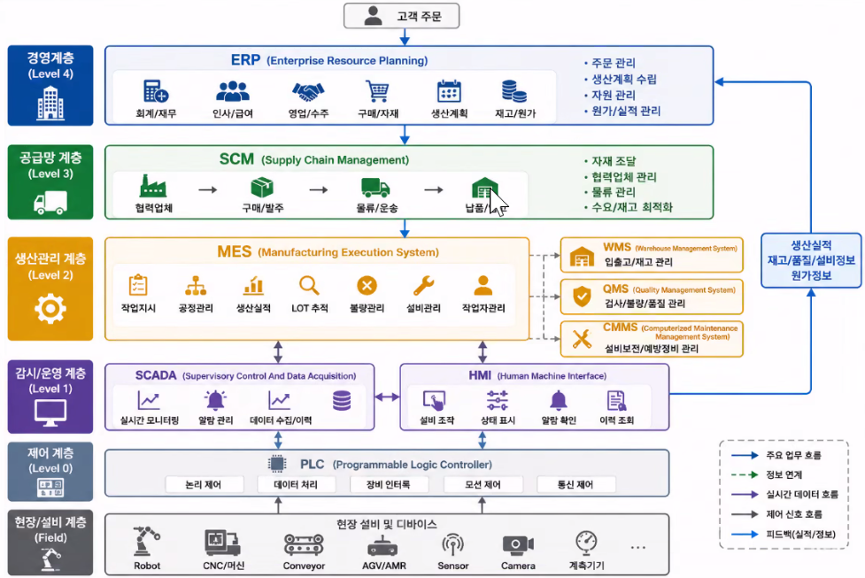
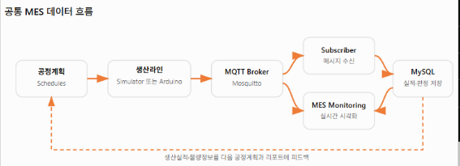
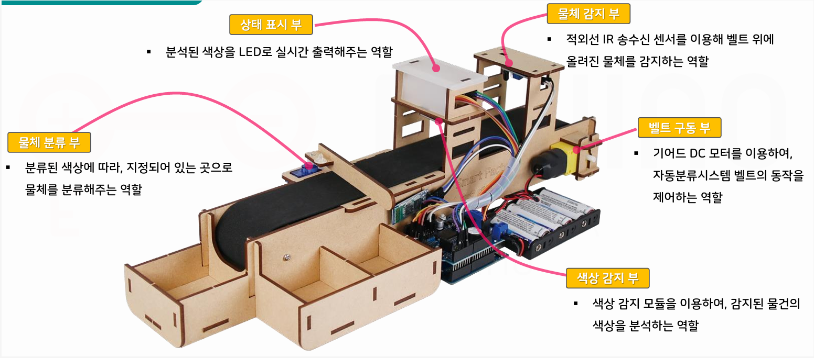
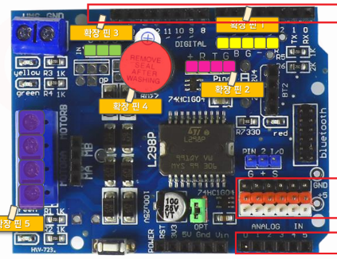
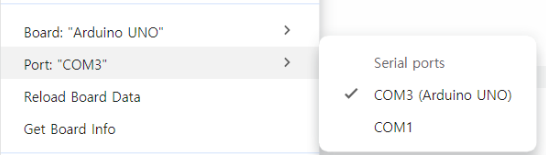
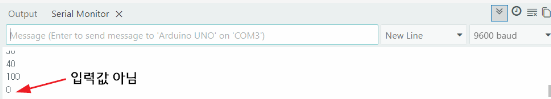
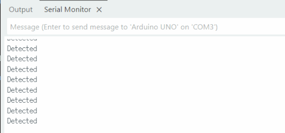
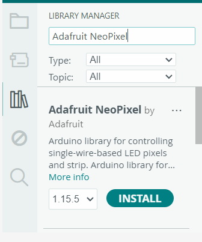
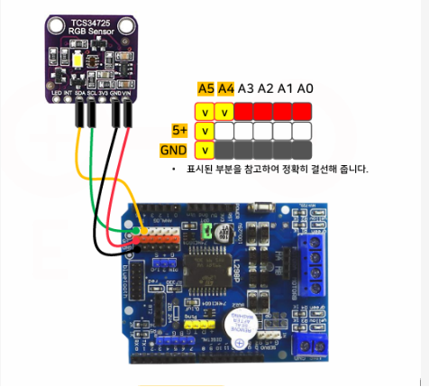
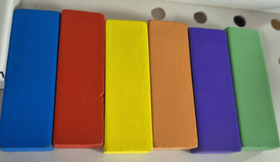

# iot-miniRroject_conveyor

## 컨베이어벨트 사용 공정관리 시스템

### 스마트팩토리
- 공장 내 모든 설비와 시스템을 연결, 데이터를 기반으로 생산을 최적화하는 제조 시스템

### 공장시스템 종류
- 회사내 다양한 종류 시스템(SW) 구성, 사용 중

|시스템명|역할|사용자|
|:--:|:--|:--|
|SCM(공급체인관리)|원자재 구매, 협력업체, 물류관리|구매팀, 물류팀|
|`ERP(전사적자원관리)`|회사 전체 업무 관리(결과위주)|경영지원, 회계, 영업, 인사...|
|MES(생산계획관리)|생산 현장 관리|생산관리자|
|PLC(생산로직제어)|기계 제어|설비|
|SCADA|설비모니터링|생산현장|
|HMI(사람-기기 인터페이스)|작업자 화면(터치패널)|작업자|
|WMS(창고관리)|창고관리,재고관리|물류|
|QMS(품질관리)|품질관리,품질계획관리|품질팀|
|CMMS(유지보수관리)|설비 유지보수|설비팀|
- 
- 공정관리
    - MES의 한 파트인 공정(MRP:자재 소요 계획)을 실시간으로 모니터링,제어
    - 스마트팩토리로 실시간으로 양품,불량을 선별 데이터 생성
    - Vision,IoT센서(적외선,X-ray,스캐너 ...)
- IIoT - Industrial IoT 대규모,높은 정밀도,고가...

### 전체 시스템 구조
- 

### 아두이노 컨베이어벨트


#### 구성 요소

##### L298P 쉴드(HAT)
- 모터드라이버를 포함한 아날로그 PWM,디지털 GPIO를 구성한 쉴드
- 모터드라이버 : 서보,DC등 모터를 쉽게 제어할 수 있도록 모듈화


- A - 디지털핀 13개
- B - 아날로그 확장핀 5개
- C - 아날로그핀 6개

- 확장핀 1 - PWM 확장핀, 5V, D6,D5,GND,D3 (A와 공유)
- 확장핀 2 - 초음파센서 확장핀, 5V,D8,D7,GND
- 확장핀 3 - 서보모터 확장핀 GND,5V,D9
- 확장핀 4 - 피에조 능동 부저,D4
- 확장핀 5 - 모터제어 포트,D13,D11,D12,D10 순

##### 테스트
- Arduino IDE로 진행
- 간단하게 부저 테스트


- 기어드 DC모터 벨트 테스트
    - L298P 쉴드에 최소 9V 전원인가
```cpp
int motorSpeedPin = 10;
int motorDirectionPin = 12;
int value;

void setup() {  
  pinMode(motorDirectionPin, OUTPUT);
  noTone(4);
}

void loop() {
  // 정방향
  digitalWrite(motorDirectionPin, HIGH);
  for (value = 0; value <= 255; value += 5) {
    analogWrite(motorSpeedPin, value);
    delay(30);
  }
  delay(1000);

  // 역방향
  digitalWrite(motorDirectionPin, LOW);
  for (value = 0; value <= 255; value += 5) {
    analogWrite(motorSpeedPin, value);
    delay(30);
  }
  delay(1000);
}

```
- 기어드 DC 모터 제어
    - 모터 스피드 값 0~255 사이에서 제어,실제 50 이하는 동작안함
    - Default 80
    - 10부터 시작하면 60에서도 동작안함. 255에서 부터 줄여가면 50에서도 동작
- Serial Monitor 사용 주의점
    - 시리얼 입력에서 New Line,Carriage Return 선택,입력하면 값 이외에 \n값 데이터 전달됨
    

- 적외선IR센서 테스트


- 서보모터 SG-90
  - 확장핀 3 연결,시그널 D9 전달
  - 각도 초기화 한 다음에 바를 연결

```cpp
// 서보모터
#include <Servo.h>
#define SERVO_PIN 9  // Digital 9
Servo servo;

void setup() {
  Serial.begin(19200);
  servo.attach(SERVO_PIN);  // 서보모터 연결
  servo.write(0);  // 0도로 초기화(!)
  delay(500);
}

void loop() {
  if (Serial.available()) {
    int value = Serial.parseInt();
    servo.write(value);
    Serial.println(value);
    delay(100);
  }
}
```

- RGB LED 네오픽셀
  - Adafruit NeoPixel 라이브러리 설치
  
```cpp
// NeoPixel LED 
#include <Adafruit_NeoPixel.h>
#define PIN 5
#define NUMPIXELS 3

Adafruit_NeoPixel pixels(NUMPIXELS, PIN, NEO_GRB + NEO_KHZ800);

void setup() {
  pixels.begin();
  pixels.setBrightness(50);
}

void loop() {
  for (int i=0; i < NUMPIXELS; i++) {
    pixels.setPixelColor(i, pixels.Color(255, 0, 0));
    pixels.show();
  }
  delay(1000);
  for (int i=0; i < NUMPIXELS; i++) {
    pixels.setPixelColor(i, pixels.Color(0, 255, 0));
    pixels.show();
    delay(10);
  }
  delay(1000);
  for (int i=0; i < NUMPIXELS; i++) {
    pixels.setPixelColor(i, pixels.Color(0, 0, 255));
    pixels.show();
    delay(10);
  }
  delay(1000);
}

```

- 컬러센서(TCS347725) 모듈
  - RGB 색상 감지
  
  ```cpp
  // Color Sensor
#include <Wire.h>
#include <Adafruit_TCS34725.h>

Adafruit_TCS34725 TCS = Adafruit_TCS34725(TCS34725_INTEGRATIONTIME_50MS, TCS34725_GAIN_4X);

void setup() {
  Serial.begin(19200);
  TCS.begin();  
}

void loop() {
  uint16_t clear, red, green, blue;
  delay(100);
  TCS.getRawData(&red, &green, &blue, &clear);

  int r = map(red, 0, 21504, 0, 2000);
  int g = map(green, 0, 21504, 0, 2000);
  int b = map(blue, 0, 21504, 0, 2000);

  Serial.print("    R: ");
  Serial.print(r);
  Serial.print("    G: ");
  Serial.print(g);
  Serial.print("    B: ");
  Serial.println(b);
}

  ```
  
  - 초기상태 RGB 4,3,3
  - 파란색 물체 : 8 , 11 ,15
  - 녹색 물체 : 14,18,10
  - 보라색 물체 : 11,9,14
  - 빨간색 물체 : 21,6,6
  - 주황색 물체 : 29,15,9


### MQTT 통신 시스템

### Unity 디지털트윈 시스템

### WPF 모니터링 시스템
